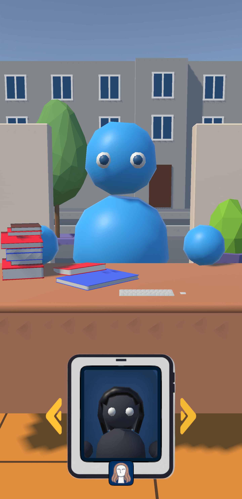
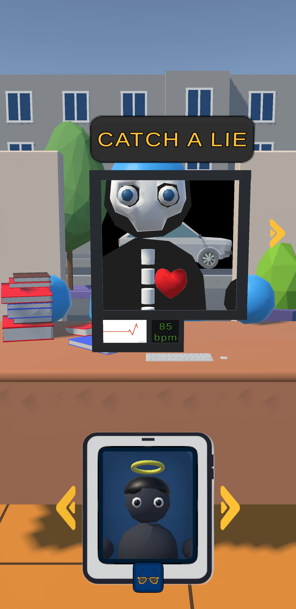
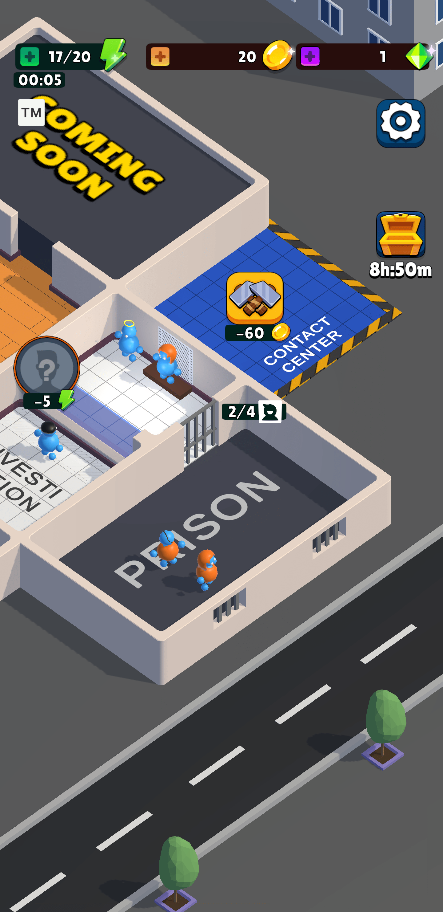
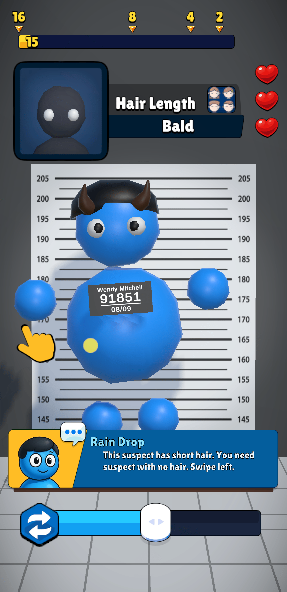
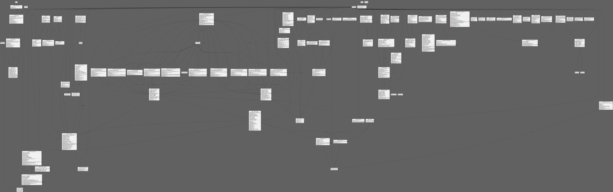

# Short description

A casual puzzle game with tycoon-inspired progression. Players run a crime-catching department, gathering evidence through mini-games and narrowing down suspects by their traits to find the criminal. By upgrading rooms and expanding the department, new mechanics unlock, while random events and daily bonuses keep investigations dynamic and rewarding.

# YouTube Gameplay Video

# Feature list

### 🕹 Core Gameplay Systems

- **Suspect Sorting Mechanics** – Implemented as the main interactive loop based on identifying and sorting suspects.

- **Interrogation mechanics** – Cross-examine informants to create a partly incorrect composite sketches, leading to the reconstruction of a correct one. In addition, periodically using a lie detector for hidden features.
    
    
    

- **Department level -** management system with smooth controls and camera transitions.
    
    
    
- **Procedural Suspect Generation** – Randomized suspects with 4 feature types, unique names, and collectible attributes.
    
    
    
- **Unlockable Rooms & Upgrades** – Progression system with animations, SFX, VFX, and meaningful gameplay impact.
    
    
    
- **Prison Room Display** – Visual showcase of player progress with dynamically wandering captured criminals. With all the distinguishing features preserved.
- **Random Event Generator** – Lightweight system for injecting simple unpredictable gameplay events. Such as an attempted robbery in a random location near the department.

---

### 📚 Player Experience Systems

- **Save/Load & Data Consistency** – Persistent data management across scenes and sessions.
- **Context-Sensitive Tutorial System** – State machine-driven, with localization support and adaptive hints.
- **Daily Reward System** – Retention mechanic with time-based rewards.

---

### 🎨 UI & UX Implementation

- **Interactive UI Systems** – EULA acceptance, settings, tutorial dialogues, hint overlays, test/debug menu, tutorial, etc.
- **UI & 3D Animations** – Implemented smooth transitions, cooling, and feedback animations.
- **Audio Settings System** – Independent SFX channels with adjustable global volume control.

---

### 🛠 Development Tools

- **Custom In-Editor Scene Switcher** – Speeds up iteration by allowing quick scene changes.
- **Custom Save-File Tweaking Tool** – Developer utility for modifying save data directly in the editor.
- **Cheat menu** – For in-game testing.

---

### ⚙️ Technical Optimization & Infrastructure

- **Optimized Build Size & Performance** – Reduced resource usage and ensured stable frame rates.
- **Analytics-Ready Systems** – Event hooks prepared for future telemetry integration.

---

### 📄 Codebase diagram

